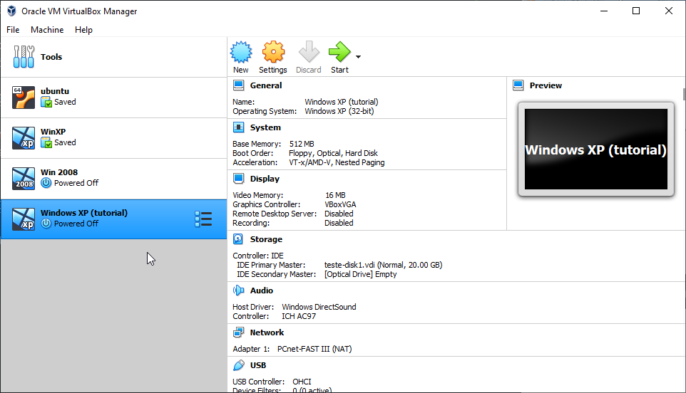

# gso-tutorial

Trabalho teórico bimestral para a matéria de Gestão de Sistemas Operacionais.

Índice:

1. [Configurar as máquinas virtuais](#1-configurar-as-máquinas-virtuais)
2. [Configurar a rede IPV4 de forma manual](#2-configurar-a-rede-ipv4-de-forma-manual)
3. [Configurar o nome de cada computador](#3-configurar-o-nome-de-cada-computador)
4. [Configurar o acesso remoto ao server](#4-configurar-o-acesso-remoto-ao-server)
5. [Configurar o DNS](#5-configurar-o-dns)
6. [Configurar DHCP](#6-configurar-dhcp)
7. [Configurar IIS](#7-configurar-iis)
8. [Configurar FTP](#8-configurar-ftp)
9. [Configurar Internet local para o server (NAT Externo)](#9-configurar-internet-local-para-o-server-nat-externo)
10. [Configurar internet para clientes do server (NAT Interno)](#10-configurar-internet-para-clientes-do-server-nat-interno)

## 1. Configurar as máquinas virtuais

### Importar a VM do Windows XP

Com os arquivos das VMs em mãos, abra o VirtualBox e selecione o menu File > Import Appliance:

Na janela aberta, clique no botão ao lado do campo File e busque o arquivo da VM do Windows XP. Feito isso, clique em Next.

Na tela de configurações, escolha um nome para a VM e, se necessário, altere a memória RAM. Se sua máquina suportar, pode-se utilizar 2048 MB (2GB), se não, você poderá diminuí-la até 512 MB. O restante das configurações não precisam ser alteradas.

Após isso, basta clicar no botão Import. Assim o processo de importação se iniciará e, ao final, a janela principal do VirtualBox aparecerá, onde estará listada também a VM importada.

### Importar a VM do Windows Server 2008

Os mesmos passos podem ser realizados para o Windows Server 2008, porém, é recomendável que se aloque mais memória RAM:

### Configurações adicionais

_Esta seção se aplica a ambas as VMs._

Com a tela principal do VirtualBox aberta, selecione a VM e clique em Settings:

Na tela de configurações, navegue até o menu de Network > Adapter 1. No campo "Attached to", selecione Internal Network, depois clique em OK.

### Iniciando as VMs

Inicie a VM do Windows Server 2008. Para isso, basta selecioná-la na lista e clicar em Start.

Assim que a VM for iniciada, o sistema pedirá para que a senha seja alterada. Apenas clique em OK e insira uma senha qualquer.

_Obs.: O sistema sempre pedirá para que seja realizada a ativação do Windows. Simplesmente selecione Ativar mais tarde._

Se tudo ocorreu normalmente, a seguinte tela será exibida:

## 2. Configurar a rede IPV4 de forma manual

### Windows Server 2008

Na VM do Windows Server 2008, clique no ícone da Rede e depois em Central de Redes e Compartilhamento:

Depois, selecione Gerenciar conexões de Rede:

Dê um duplo clique na Conexão local para abrir a janela de Status, depois clique em Propriedades:

Selecione "Protocolo TCP/IP Versão 4 (TCP/IPv4) e clique em Propriedades:

Selecione "Usar o seguinte endereço IP" e insira os valores a seguir:

Selecione OK e feche as outras janelas. A seguinte tela deverá aparecer, selecione Lugar público e depois clique em Fechar:

Feche a tela atual para voltar à Central de Rede e Compartilhamento. Aqui, selecione Firewall do Windows:

Selecione Alterar configurações, depois OFF:

Clique em Aplicar, depois em OK. Feche a janela do Firewall e volte à Central de Rede e Compartilhamento.

Aqui, selecione Descoberta de Rede e ative-a:

Em Compartilhamento de pasta pública, seleciona a seguinte opção:

Desative o Compartilhamento protegido por senha:

### Windows XP

Na VM do Windows XP, clique no ícone de Rede e depois em Propriedades:

Selecione Protocolo TCP/IP, depois Propriedades. Na janela seguinte, selecione Usar o seguinte endereço IP e insira os seguintes valores:

Selecione Iniciar > Painel de Controle > Central de Segurança. Selecione Firewall do Windows:

Desative o Firewall e clique OK.

## 3. Configurar o nome de cada computador

### Windows Server 2008

Na tela de Trarefas e Configurações Iniciais, selecionar Fornecer o nome e domínio do computador:

Clique em Alterar, insira o nome `server01`, depois clique em mais:

Insira `com` e clique em OK:

Ao fechar as janelas, o sistema pedirá para reiniciar o computador. Selecione "Reiniciar Agora" e espere a VM reiniciar.

### Windows XP

No Painel de Controle, selecione Sistema, depois vá até a aba Nome do Computador e clique em Alterar. Modifique o Grupo de trabalho para `WORKGROUP`:

Ao fechar as janelas, o sistema pedirá para reiniciar o computador. Selecione "SIM" e espere a VM reiniciar.

## 4. Configurar o acesso remoto ao server

### Pastas compartilhadas

No Windows Server 2008, selecione Iniciar > Documentos e crie uma pasta qualquer. Clique nela com o botão direito e vá em Compartilhar. Na janela de compartilhamento, selecione o primeiro campo de texto, digite "todos" e clique em Adicionar:

No nível de permissão, selecione Parceria:

Clique em Compartilhar e depois em Pronto. Clique novamente com o botão direito na pasta e selecione Propriedades, na aba Compartilhamento, selecione Compartilhamento Avançado. Na nova janela, selecione Compartilhar a pasta, depois clique em Permissões:

Na janela de permissões, selecione Todos, depois permita o Controle total:

No Windows XP, selecione Iniciar > Todos os Programas > Acessórios > Windows Explorer > Meus locais de rede. A pasta "Portal em Server01" deve estar disponível.

### Acesso remoto

No Windows Server 2008, abra o menu Iniciar > Painel de Controle > Contas de Usuário e selecione Gerenciar outra conta:

Selecione Criar nova conta, insira um nome qualquer, mantendo Usuário padrão selecionado, depois clique em Criar conta.

Selecione o usuário criado e clique em Criar uma senha. Insira uma senha qualquer.

Repita o mesmo processo para criar mais uma conta, mas desta vez selecione Administrador ao criá-lo.

Volte para a tela de Tarefas de Configuração Iniciais e selecione Habilitar Área de Trabalho Remota. Na nova janela, selecione a seguinte opção:

Clique em Selecionar Usuários, depois em Adicionar, digite o nome de usuário administrador criado anteriormente e clique em Verificar nomes:

## 5. Configurar o DNS

### Windows Server 2008

Na janela de Tarefas de Configuração Iniciais, selecione Adicionar funções:

Clique em próximo, depois selecione Servidor DNS, clique em Próximo duas vezes e depois em Instalar. Assim que a instalação terminar, abra o menu Iniciar > Ferramentas Administrativas > DNS. Clique em SERVER01:

Clique com o botão direito em Zonas de pesquisa direta e selecione "Nova zona...". Clique em Avançar, depois selecione Zona primária:

Clique em Avançar, depois insira o nome `server01.com` e clique em Avançar até concluir. O resultado final deve ser o seguinte:

Agora, clique com o botão direito em Zonas de pesquisa inversa e selecione "Nova zona...". Clique em avançar até alcançar a seguinte tela, e então insira o seguinte conteúdo:

Clique em Avançar até concluir. O resultado final deve ser o seguinte:

Clique em Zonas de pesquisa direta, depois selecione `server01.com`. Clique com o botão direito no painel à direita e selecione "Novo Host (A ou AAAA)...". Insira os seguintes dados, depois clique em Adicionar host:

Após o host ser criado, feche a caixa de diálogo. Clique novamente com o botão direito no painel à direita e selecione "Novo alias (CNAME)...". Insira `www` no primeiro campo, depois clique em Procurar:

Na janela nova, selecione SERVER01 > Zonas de pesquisa direta > server01.com > (igual à pasta pai):

Clique em OK duas vezes, o resultado final deverá ser o seguinte:

## 6. Configurar DHCP

Na janela de Tarefas de Configuração Iniciais, selecione Adicionar funções:

Clique em próximo e selecione Servidor DHCP. Clique em próximo até alcançar a seguinte tela, e então insira os seguintes dados:

Selecione próximo até chegar na seguinte tela, e então clique no botão Adicionar:

Insira as seguintes informações:

Selecione OK, depois clique em próximo. Selecione Desabilitar:

Clique em próximo, depois Instalar.

### Windows XP

Abra o menu Iniciar > Painel de Controle > Conexões de Rede e Internet > Conexões de Rede e selecione Conexão local. Clique em Propriedades, selecione Protocolo TCP/IP e clique em Propriedanes novamente. Selecione Obter um endereço IP automaticamente:

## 7. Configurar IIS

### Windows Server 2008

Abra o menu Iniciara > Ferramentas Administrativas > Gerenciador de Servidores > Funções > Adicionar funções. Selecione Servidor Web (IIS) e, ao abrir uma janela, selecione Adicionar Recursos Necessários.

Clique em Próximo até chegar na seguinte tela:

E então selecione as seguintes opções:

- Servidor Web
  - Recuros HTTP Comuns
    - Marcar todos
  - Desenvolvimento de aplicativos
    - Marcar todos
- Ferramentas de Gerenciamento
  - Compatibilidade com Gerenciamento do ISS 6
    - Marcar todos
- Serviço de Publicação FTP
  - Marcar todos

Clique em Próximo, e depois em Instalar.

Selecione o menu Iniciar > Todos os Programas > Acessórios > Windows Explorer. Navegue até a pasta `C:\inetpub\wwwroot` e crie uma pasta com o nome desejado para o site, por exemplo, `gso.com`. Dentro desta pasta, crie um arquivo chamado `index.htm` e insira o conteúdo desejado do site no arquivo.

Selecione o menu Iniciar > Ferramentas Administrativas > Gerenciador de Serviços de Informações da Internet (IIS). Selecione SERVER01 e clique com o botão direito em Sites > Adicionar Site. Preencha os seguintes campos e depois clique em OK:

Selecione o menu Iniciar > Ferramentas Administrativas > DNS. Selecione Zonas de pesquisa direta (com o botão direito) > Nova zona. Siga os passos descritos na seção de DNS, preenchendo o nome da zona como `gso.com`. Selecione a zona criada e clique com o botão direito no painel à direita, então selecione Novo Host (A ou AAAA). Preencha o campo Endereço IP como `192.168.10.1` e mantenha a _checkbox_ marcada, então clique em Adicionar Host. Clique novamente com o botão direito e selecione Novo Alias (CNAME). Siga os passos descritos na seção de DNS, porém selecionando `gso.com` ao invés de `server01`.

## 8. Configurar FTP

### Windows Server 2008

Selecione o menu Iniciar > Ferramentas Administrativas > Gerenciador de Serviços de Informações da Internet (IIS). Selecione Sites FTP e clique em "Clique aqui para iniciar". A janela do IIS 6 deve abrir. Selecione SERVER01 > Sites FTP, e então, com o botão direito em Default FTP Site, Iniciar. Selecione Sim na janela que se abriu.

Selecione o menu Iniciar > Ferramentas Administrativas > DNS. Selecione `server01.com`, depois com o botão direito no painel selecione Novo Alias (CNAME). Preencha `ftp` no primeiro campo, depois selecione Procurar e vá até `server01.com` > (igual à pasta pai).

Todo o conteúdo dentro de `C:\inetpub\ftproot` estará disponível no servidor FTP, acessado pela URL `ftp://ftp.server01.com/`.

## 9. Configurar Internet local para o server (NAT Externo)

### Windows Server 2008

Na janela principal do VirtualBox, selecione a VM do Windows Server 2008 e abra o menu Settings > Network > Adapter 2 e insira as seguintes opções:

Inicie a VM novamente. Após Iniciar e fazer o login, selecione Iniciar > Painel de Controle > Centro de Rede e Compartilhamento > Gerenciar conexões de rede. Renomeie "Conexão Local" para "rede interna" e "Conexão local 2" para "rede externa".

## 10. Configurar internet para clientes do server (NAT Interno)

### Windows Server 2008

Abra o menu Iniciar > Ferramentas Administrativas > Gerenciador de Servidores > Funções > Adicionar funções. Selecione "Serviços de Acesso e Diretiva de Rede". Selecione próximo até chegar na seguinte tela, e então marque as seguintes opções:

Selecione Próximo e depois Instalar.

Abra o menu Iniciar > Ferramentas Administrativas > Roteamento e acesso remoto. Clique com o botão direito em SERVER01 e selecione Configurar e Habilitar Roteamento e Acesso Remoto. Clique em avançar e selecione a seguinte opção:

Clique em avançar. Na próxima tela, selecione "rede externa" e clique em Avançar, depois Concluir.
