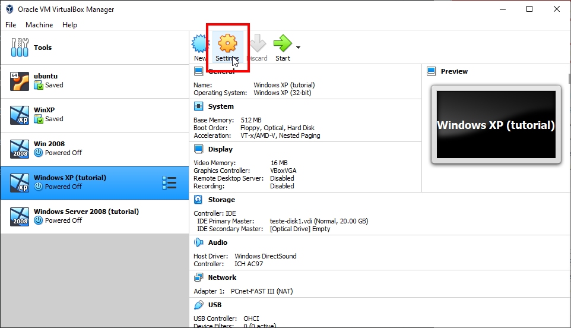

# gso-tutorial

Trabalho teórico bimestral para a matéria de Gestão de Sistemas Operacionais.

## 1. Configurar as máquinas virtuais

### Importar a VM do Windows XP

Com os arquivos das VMs em mãos, abra o VirtualBox e selecione o menu File > Import Appliance:

Na janela aberta, clique no botão ao lado do campo File e busque o arquivo da VM do Windows XP. Feito isso, clique em Next.

Na tela de configurações, escolha um nome para a VM e, se necessário, altere a memória RAM. Se sua máquina suportar, pode-se utilizar 2048 MB (2GB), se não, você poderá diminuí-la até 512 MB. O restante das configurações não precisam ser alteradas.

Após isso, basta clicar no botão Import. Assim o processo de importação se iniciará e, ao final, a janela principal do VirtualBox aparecerá, onde estará listada também a VM importada.

### Importar a VM do Windows Server 2008

Os mesmos passos podem ser realizados para o Windows Server 2008, porém, é recomendável que se aloque mais memória RAM:

### Configurações adicionais

_Esta seção se aplica a ambas as VMs._

Com a tela principal do VirtualBox aberta, selecione a VM e clique em Settings:

Na tela de configurações, navegue até o menu de Network > Adapter 1. No campo "Attached to", selecione Internal Network, depois clique em OK.

### Iniciando as VMs

Inicie a VM do Windows Server 2008. Para isso, basta selecioná-la na lista e clicar em Start.

Assim que a VM for iniciada, o sistema pedirá para que a senha seja alterada. Apenas clique em OK e insira uma senha qualquer.

_Obs.: O sistema sempre pedirá para que seja realizada a ativação do Windows. Simplesmente selecione Ativar mais tarde._

Se tudo ocorreu normalmente, a seguinte tela será exibida:

## 2. Configurar a rede IPV4 de forma manual

Na VM do Windows Server 2008, clique no ícone da Rede e depois em Central de Redes e Compartilhamento:

Depois, selecione Gerenciar conexões de Rede:

Dê um duplo clique na Conexão local para abrir a janela de Status, depois clique em Propriedades:

Selecione "Protocolo TCP/IP Versão 4 (TCP/IPv4) e clique em Propriedades:

Selecione "Usar o seguinte endereço IP" e insira os valores a seguir:

Selecione OK e feche as outras janelas. A seguinte tela deverá aparecer, selecione Lugar público e depois clique em Fechar:

Feche a tela atual para voltar à Central de Rede e Compartilhamento. Aqui, selecione Firewall do Windows:

Selecione Alterar configurações, depois OFF:

Clique em Aplicar, depois em OK. Feche a janela do Firewall e volte à Central de Rede e Compartilhamento.

Aqui, selecione Descoberta de Rede e ative-a:

Em Compartilhamento de pasta pública, seleciona a seguinte opção:

Desative o Compartilhamento protegido por senha:

## 3. Configurar o nome de cada computador

## 4. Configurar o acesso remoto ao server

## 5. Configurar o DNS

## 6. Configurar DHCP

## 7. Configurar IIS

## 8. Configurar FTP

## 9. Configurar Internet local para o server (NAT Externo)

## 10. Configurar internet para clientes do server (NAT Interno)
